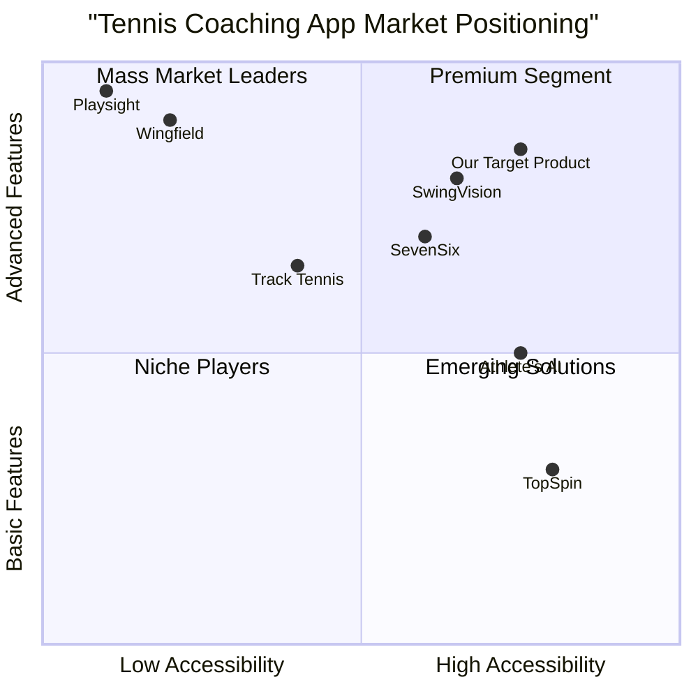

# Product Requirements Document: AI Tennis Coach Web Application

## 1. Introduction

### 1.1 Purpose
This document outlines the comprehensive requirements for an AI-powered tennis coaching web application designed to help players of all levels improve their game through advanced analytics, personalized training, and performance tracking.

### 1.2 Scope
The AI Tennis Coach web application will provide users with swing analysis, personalized training programs, performance tracking, and feedback mechanisms. The application will leverage computer vision technology, machine learning algorithms, and a user-friendly interface to deliver professional-level coaching at an accessible price point.

### 1.3 Original Requirements
Create a comprehensive Product Requirements Document (PRD) for an AI tennis coach web application. Include market analysis, user personas, competitive product analysis, and detailed feature specifications. Consider functionalities such as swing analysis, training programs, performance tracking, and feedback mechanisms.

## 2. Product Definition

### 2.1 Product Goals

1. **Democratize Access to Professional-Quality Tennis Coaching**: Provide high-quality, data-driven coaching and feedback to players regardless of their location or budget constraints.

2. **Enhance Player Development Through Data-Driven Insights**: Leverage AI and machine learning to deliver objective analysis and personalized improvement recommendations that accelerate skill development.

3. **Create an Engaged Community of Improving Players**: Foster a supportive ecosystem where players can track progress, share achievements, and maintain motivation through measurable improvements.

### 2.2 User Stories

1. **As a competitive college player**, I want to analyze the mechanics of my serve in detail, so that I can identify and correct flaws that are limiting my consistency and power.

2. **As a recreational weekend player**, I want personalized practice drills that fit into my limited training time, so that I can maximize improvement despite my busy schedule.

3. **As a junior tennis player**, I want to compare my technique to professional players, so that I can develop proper fundamentals from an early stage.

4. **As a tennis coach**, I want to remotely monitor my students' practice sessions and progress, so that I can provide timely feedback and adjust training programs accordingly.

5. **As a returning player after injury**, I want to track my performance metrics over time, so that I can ensure my recovery is on track and identify areas that need additional focus.

### 2.3 Competitive Analysis

#### SwingVision
- **Pros**: Real-time video processing, automatic shot detection, ball tracking, and line calling. Endorsed by major tennis associations.
- **Cons**: Limited to iOS devices, relatively expensive subscription model, and requires specific device positioning.

#### SevenSix
- **Pros**: Professional technique comparison, comprehensive body movement analysis, and actionable coaching advice.
- **Cons**: Subscription-based pricing, limited sharing capabilities, and requires good lighting conditions.

#### Athlete's AI
- **Pros**: Single smartphone camera approach, multi-sport capability, and accessible to all player levels.
- **Cons**: Less tennis-specific features, more general analytics, and limited training program guidance.

#### Track Tennis / Baseline Vision
- **Pros**: Strong statistics tracking, video replays, and structured drills.
- **Cons**: Requires portable camera system, more complex setup, and less intuitive user interface.

#### Wingfield
- **Pros**: Smart court technology, comprehensive match data collection, and professional-grade analytics.
- **Cons**: Requires physical court installation, high cost, and limited accessibility for casual players.

#### Playsight
- **Pros**: Multi-camera advanced analytics, tactical analysis, and professional training environment.
- **Cons**: Extremely high cost, facility-based installation, and inaccessible to most individual players.

#### TopSpin
- **Pros**: Simple user interface, basic stroke analysis, and affordable pricing.
- **Cons**: Limited advanced features, less accurate analytics, and minimal personalization.

### 2.4 Competitive Quadrant Chart

## 3. Technical Specifications

### 3.1 Requirements Analysis

Based on market research, competitive analysis, and user personas, the AI Tennis Coach web application requires several key technical components:

1. **Computer Vision System**: To accurately analyze player movements, stroke mechanics, and ball trajectory in various environments.

2. **Machine Learning Algorithms**: To provide personalized feedback, identify improvement areas, and generate custom training programs.

3. **Cloud Infrastructure**: To process video uploads, store user data, and deliver real-time analytics.

4. **Responsive Web Application**: To provide a seamless experience across devices with varying screen sizes.

5. **User Management System**: To handle accounts, progress tracking, and social features.

6. **Video Processing Pipeline**: To handle upload, processing, analysis, and storage of user-submitted videos.

7. **Training Program Generator**: To create personalized practice routines based on user data and goals.

8. **Performance Analytics Dashboard**: To visualize progress, metrics, and areas for improvement.

### 3.2 Requirements Pool

#### P0 (Must Have)
- Video upload and processing system for stroke analysis
- Computer vision algorithm for tennis stroke recognition and analysis
- User profile and progress tracking dashboard
- Basic technique feedback system with improvement suggestions
- Responsive web interface compatible with desktop and mobile browsers
- Secure user authentication and data protection
- Video library of correct technique demonstrations
- Basic training program generator

#### P1 (Should Have)
- Real-time video analysis through web browser
- Pro player comparison feature with side-by-side analysis
- Advanced metrics tracking (swing speed, ball spin, contact point precision)
- Social sharing capabilities for progress and achievements
- Coach connection platform for remote professional feedback
- Court finder integration to locate practice facilities
- Practice scheduling and reminder system
- Community forum for player discussions

#### P2 (Nice to Have)
- Multi-player analysis for doubles teams
- AI-powered opponent analysis from match footage
- Tactical pattern recognition and strategy recommendations
- Equipment recommendations based on playing style
- Tournament preparation guides
- Injury prevention recommendations based on biomechanics
- Weather integration for outdoor practice planning
- Nutrition and fitness companion features

### 3.3 UI Design Draft

#### Home Dashboard
- Progress summary cards
- Recent activity feed
- Quick access to video analysis tool
- Training program for today
- Community highlights
- Performance metrics trend graphs

#### Video Analysis Interface
- Video upload/recording area
- Playback controls with slow motion and frame-by-frame navigation
- Split-screen for technique comparison
- Annotation tools for technique highlights
- AI feedback panel with actionable insights
- Historical comparison with previous uploads

#### Training Program Builder
- Goal selection interface
- Available time input
- Skill level assessment
- Focus area selection
- Generated program calendar view
- Drill instruction cards with video examples
- Progress tracking for each skill area

#### Performance Analytics
- Shot accuracy heat maps
- Technique consistency graphs
- Improvement trajectory visualization
- Strength and weakness analysis
- Comparative benchmarks against peers
- Milestone achievements display

### 3.4 Open Questions

1. **Technical Limitations**: What are the minimum device specifications (camera quality, processing power) needed for accurate video analysis?

2. **Data Privacy**: How will we handle storage and processing of user videos while ensuring privacy compliance?

3. **Accuracy Validation**: What methodology will be used to validate the accuracy of our AI coaching recommendations?

4. **Monetization Strategy**: Should the application use a subscription model, freemium approach, or one-time purchase?

5. **Offline Functionality**: What features should be available when users have limited or no internet connectivity?

6. **Court Variation Handling**: How will the system account for different court surfaces, lighting conditions, and camera angles?

## 4. User Experience

### 4.1 User Personas

#### Alex (Competitive College Player)
- **Age**: 20
- **Occupation**: Full-time student, collegiate tennis team member
- **Goals**: Improve serve consistency, develop tactical awareness, advance in collegiate rankings
- **Pain Points**: Limited access to professional coaches, difficulty identifying technical flaws, struggles with mental game
- **Usage Pattern**: Daily practice sessions, weekend tournaments, regular video analysis
- **Technical Proficiency**: High

#### Maria (Recreational Adult Player)
- **Age**: 35
- **Occupation**: Marketing executive
- **Goals**: Improve overall game for local club competitions, efficient use of limited practice time
- **Pain Points**: Cannot afford regular coaching, limited practice time, plateau in skill development
- **Usage Pattern**: Weekend practice, occasional weekday evenings, monthly club tournaments
- **Technical Proficiency**: Medium

#### Trevor (Junior Tennis Aspirant)
- **Age**: 12
- **Occupation**: Middle school student
- **Goals**: Develop proper fundamentals, make school team, prepare for tournaments
- **Pain Points**: Limited parental budget for coaching, needs basic technique guidance, inconsistent practice habits
- **Usage Pattern**: After-school practice, weekend sessions, school competitions
- **Technical Proficiency**: Low to Medium

#### Coach Sarah (Tennis Professional)
- **Age**: 45
- **Occupation**: Tennis coach at local club
- **Goals**: Scale coaching business, provide better feedback to students, track student progress
- **Pain Points**: Cannot be present for all student practices, difficult to monitor technique changes over time
- **Usage Pattern**: Daily professional use, student video reviews, program development
- **Technical Proficiency**: Medium

### 4.2 User Journeys

#### New User Onboarding
1. User creates account with basic information
2. Completes skill assessment (questionnaire and optional video upload)
3. Sets goals and available practice time
4. Receives personalized dashboard and initial training program
5. Views tutorial on how to record and upload swing videos
6. Completes first video analysis session with guided assistance

#### Regular Training Session
1. User logs in and checks daily training recommendation
2. Reviews technique tips for today's focus areas
3. Practices recommended drills
4. Records video of practice session
5. Uploads video for analysis
6. Reviews AI feedback and annotations
7. Saves specific focus points for next session

#### Progress Review
1. User navigates to performance analytics section
2. Views progress graphs for key metrics
3. Compares current technique videos with historical recordings
4. Reviews completed training milestones
5. Adjusts goals based on progress
6. Shares achievements with community or coach

## 5. Market Analysis

### 5.1 Market Size and Growth

The global AI in tennis market was valued at approximately $1.2 billion in 2024 and is projected to grow at a compound annual growth rate (CAGR) of approximately 14.7% through 2032. This growth is driven by several factors:

- Increasing adoption of AI-powered analytics in professional and amateur sports
- Growing demand for data-driven insights to enhance player performance
- Rising popularity of virtual coaching solutions
- Expanding accessibility of high-quality mobile cameras capable of motion analysis
- Increasing consumer willingness to invest in technology-enhanced training tools

### 5.2 Target Market Segments

1. **Competitive Players (25%)**
   - Junior tournament players
   - Collegiate athletes
   - Club-level competitors
   - Senior circuit participants

2. **Recreational Enthusiasts (40%)**
   - Weekend players
   - Tennis club members
   - Adult improvers
   - Seasonal players

3. **Tennis Professionals (15%)**
   - Club coaches
   - Private instructors
   - Academy trainers
   - Remote coaching businesses

4. **Facilities and Institutions (20%)**
   - Tennis academies
   - Schools and universities
   - Tennis clubs and centers
   - Resort sports programs

### 5.3 Market Trends

1. **Democratization of Elite Training**
   - Technologies previously available only to professional players becoming accessible to amateurs
   - Increasing demand for affordable alternatives to expensive private coaching

2. **Remote Coaching Evolution**
   - Growth in distance coaching relationships facilitated by technology
   - Rising acceptance of virtual instruction as a supplement to in-person lessons

3. **Data-Driven Performance Culture**
   - Shift toward objective metrics and analysis in recreational sports
   - Growing understanding of biomechanics among amateur players

4. **Community-Based Improvement**
   - Increased interest in social aspects of athletic development
   - Rise of peer comparison and friendly competition as motivational tools

5. **Mobile-First Technology Adoption**
   - Preference for solutions that work seamlessly with existing devices
   - Expectation of professional-quality analysis from consumer hardware

### 5.4 Revenue Model

#### Primary Revenue Streams

1. **Subscription Tiers**
   - Basic (Free): Limited video analyses, basic feedback, community access
   - Standard ($9.99/month): Unlimited video analyses, personalized training programs, performance tracking
   - Premium ($19.99/month): Advanced metrics, pro technique comparison, priority processing
   - Coach ($49.99/month): Student management, team analytics, remote coaching tools

2. **Additional Revenue Sources**
   - In-app purchases for specialized training modules
   - Partnership integrations with equipment manufacturers
   - Affiliate commissions from lesson bookings with certified coaches
   - White-label solutions for tennis academies and facilities
   - Data insights (anonymized and aggregated) for market research

## 6. Implementation Strategy

### 6.1 Development Roadmap

#### Phase 1: MVP (3 months)
- User account system
- Basic video upload and analysis
- Fundamental stroke feedback
- Simple training recommendation engine
- Core performance metrics
- Responsive web interface

#### Phase 2: Enhanced Features (3 months)
- Real-time video analysis
- Advanced metrics and insights
- Expanded training program library
- Coach connection platform
- Community features and sharing

#### Phase 3: Ecosystem Development (6 months)
- Mobile applications (iOS and Android)
- API for third-party integrations
- Advanced analytics dashboard
- Tournament preparation tools
- Equipment recommendation engine

### 6.2 Technical Implementation

#### Frontend Technology
- React for web application
- Tailwind CSS for styling
- WebRTC for real-time video processing
- D3.js for data visualization

#### Backend Technology
- Node.js server environment
- MongoDB for user data and analytics
- Python for machine learning components
- TensorFlow and OpenCV for computer vision
- AWS for cloud infrastructure and video processing

### 6.3 Key Performance Indicators

- Monthly Active Users (MAU)
- Video Analysis Accuracy Rate
- User Retention Rate
- Average Session Duration
- Feature Adoption Percentage
- Subscription Conversion Rate
- Net Promoter Score (NPS)
- User Performance Improvement Metrics

## 7. Risks and Mitigations

### 7.1 Technical Risks

| Risk | Severity | Mitigation Strategy |
|------|----------|---------------------|
| Inaccurate stroke analysis | High | Continuous algorithm training, professional validation, confidence scoring |
| Performance issues with video processing | Medium | Optimized cloud processing, quality-based tier system, compression options |
| Device compatibility limitations | Medium | Progressive enhancement design, clear minimum requirements, diagnostic tool |
| Data security vulnerabilities | High | Regular security audits, encryption, GDPR compliance, limited data retention |

### 7.2 Market Risks

| Risk | Severity | Mitigation Strategy |
|------|----------|---------------------|
| Low user adoption | High | Free tier offering, focused marketing, strategic partnerships with clubs |
| Competitor response | Medium | Unique feature development, community building, faster innovation cycle |
| Price sensitivity | Medium | Value-based pricing, clear ROI demonstration, feature-based tiering |
| Coach resistance | Medium | Coach partnership program, revenue sharing, coach-enhancing tools |

## 8. Conclusion

The AI Tennis Coach web application addresses a significant market need by providing accessible, data-driven tennis instruction to players of all levels. By leveraging cutting-edge AI technology and computer vision algorithms, the platform will democratize access to high-quality coaching and performance analysis previously available only to elite athletes.

With a clear understanding of user personas, competitive landscape, and technical requirements, this PRD provides a comprehensive roadmap for developing a product that can significantly impact the tennis training market. The phased implementation approach allows for iterative improvement based on user feedback while managing development risks.

The combination of robust technical capabilities, user-centered design, and strategic market positioning creates a compelling case for the AI Tennis Coach web application's potential success in the growing sports technology market.
